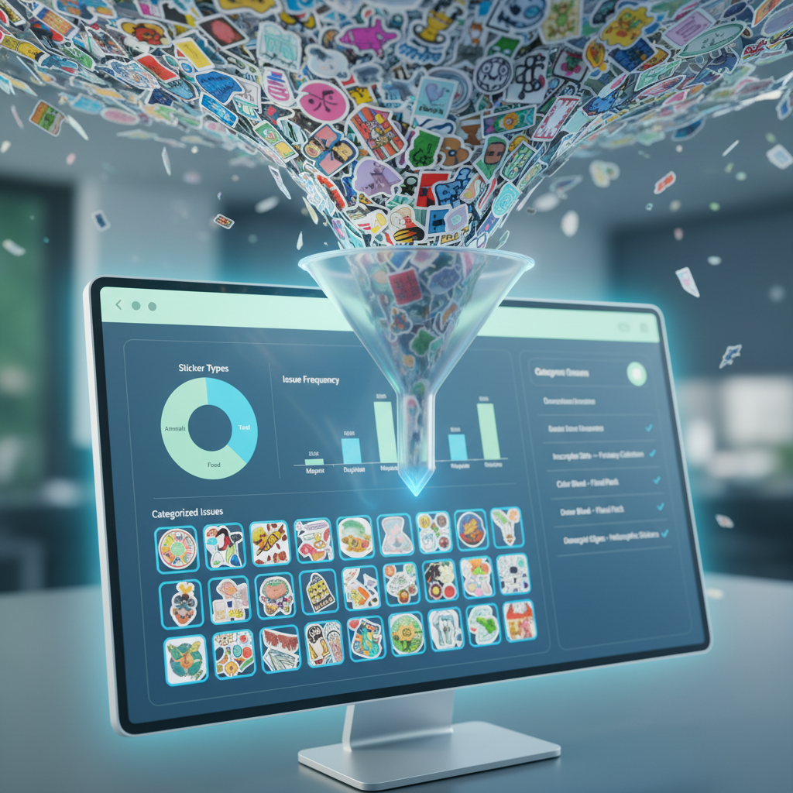
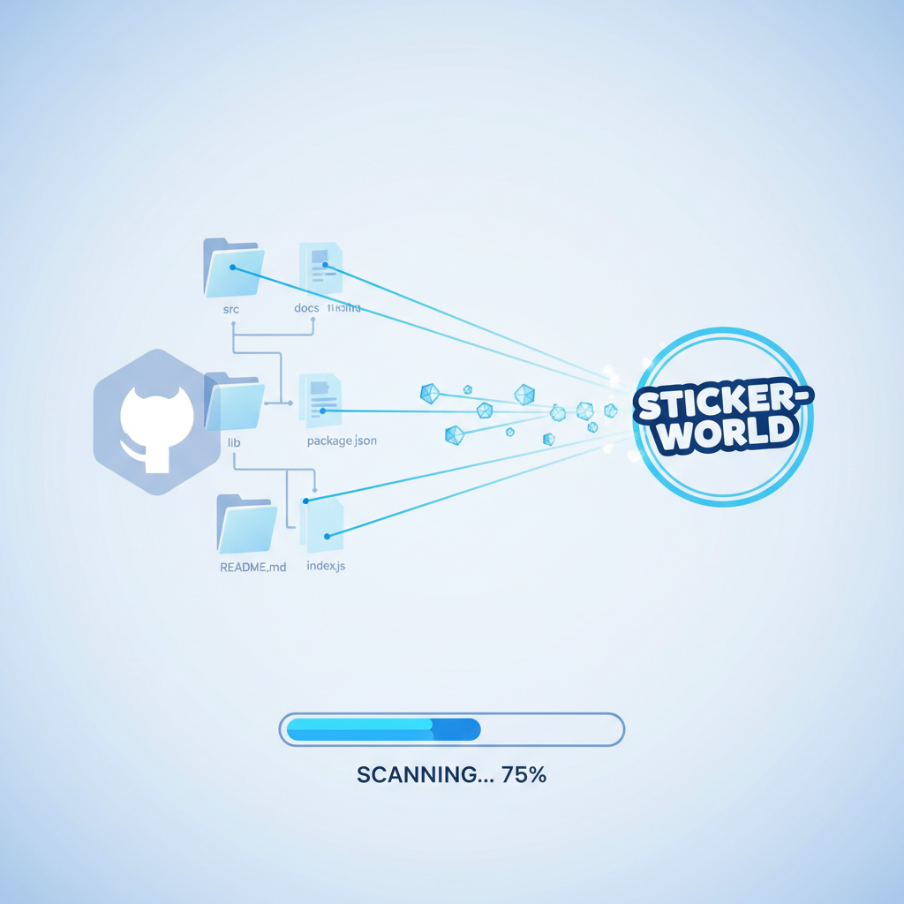
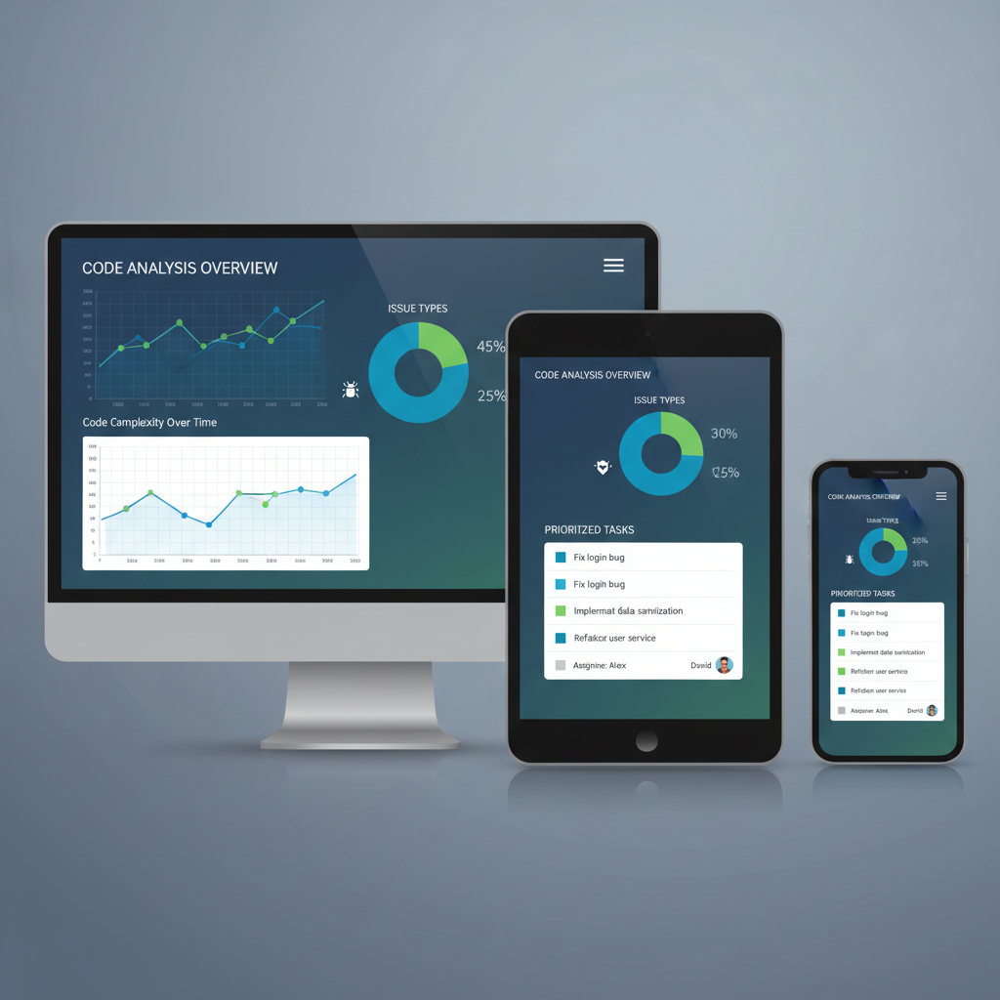
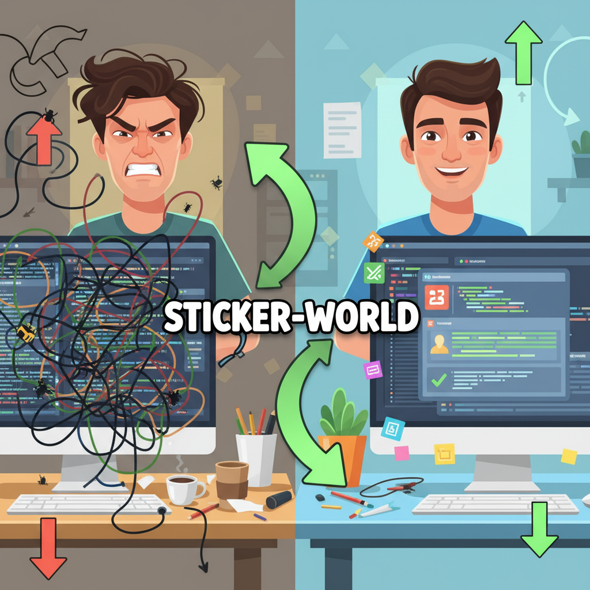
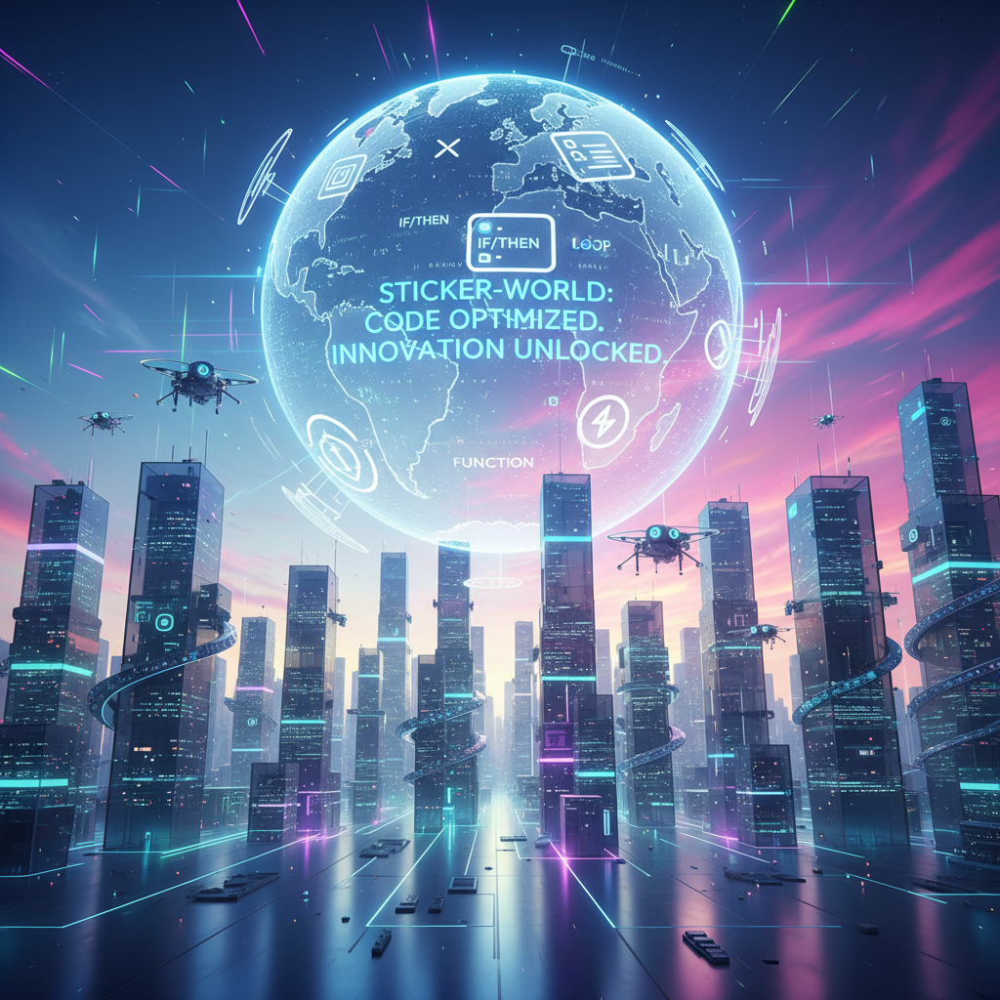

# 🎬 Visual Storyboard - sticker-world

> *Storyboard visual generado para explicar el proyecto*

---

## 📊 Información del Proyecto

- **🏗️ Nombre:** sticker-world
- **📝 Descripción:** AI-powered repository analysis tool
- **⚙️ Tecnologías:** JavaScript, Node.js/npm, Yarn
- **🎯 Propósito:** A software project built with JavaScript, Node.js/npm, Yarn

---

## 🎨 Configuración del Storyboard

- **🎬 Escenas generadas:** 8
- **🎭 Estilo visual:** technical
- **📁 Directorio de salida:** ./storyboard

---

## 🖼️ Escenas Generadas

### Escena 1

*scene_01_sticker_explosion!.png*

### Escena 2

*scene_02_enter_sticker-world.png*

### Escena 3

*scene_03_repository_scan.png*

### Escena 4

*scene_04_ai_analysis:_deep_dive.png*

### Escena 5

*scene_05_dashboard_overview.png*

### Escena 6

*scene_06_developer_workflow:_fixing_issues.png*

### Escena 7

*scene_07_project_benefits.png*

### Escena 8

*scene_08_future_vision.png*

---

## 💡 Uso del Storyboard

Este storyboard visual puede ser utilizado para:

- 📢 **Presentaciones** - Explicar el proyecto a stakeholders no técnicos
- 📚 **Documentación** - Añadir elementos visuales a la documentación
- 🎓 **Onboarding** - Ayudar a nuevos desarrolladores a entender el proyecto
- 💼 **Propuestas** - Comunicar la funcionalidad y valor del proyecto

---

## 🛠️ Generado con

- **🤖 AI:** Google Gemini para generación de imágenes
- **📊 Análisis:** Claude AI para análisis de repositorio
- **⚡ Herramienta:** Repo Analyst

---

*🤖 Generado automáticamente el 20/9/2025*
